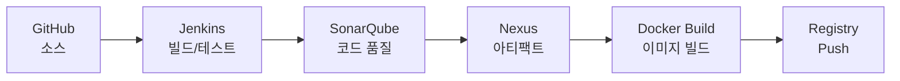

<!-- ╔══════════════════════════════════════════════════════════╗ -->
<!-- ║  HEADER                                                    ║ -->
<!-- ╚══════════════════════════════════════════════════════════╝ -->

> ### "Don't build services repeatedly. Build a platform that builds services."

현재 AI 기반 개발 환경(**Claude Code · Harness · Superpowers**)을 활용해 개발 생산성을 극대화하는 방법을 연구하고 있습니다.
코드 작성은 더 이상 병목이 아닙니다 — 진짜 병목은 **인프라 · 아키텍처 설계 · 서비스 간 연동**입니다.
그래서 새 프로젝트마다 반복되는 작업을 제거하기 위해 재사용 가능한 **MSA Starter Platform** 을 구축하고 있습니다.

 

### 🛠️ Tech Stack

 

 

 

---

## 🎯 목표

- **빠른 프로젝트 시작** — 표준화된 환경으로 보일러플레이트 최소화
- **MSA Best Practice** 기본 적용
- **확장 가능한 아키텍처** — 서비스 / 인프라 교체 및 추가 용이
- **CI/CD 및 모니터링** 기본 제공
- **단계적 성장** — 1단계 (Compose) → 2단계 (K8s) → 3단계 (AI)

---

<!-- ╔══════════════════════════════════════════════════════════╗ -->
<!-- ║  MSA STARTER TEMPLATE                                       ║ -->
<!-- ╚══════════════════════════════════════════════════════════╝ -->

## 🏗️ MSA Starter Template

> 확장 가능한 MSA(Microservice Architecture) 개발 기본 템플릿
> **단계별 학습 목표 프로젝트** — Docker Compose → Kubernetes + ArgoCD → Spring AI

표준화된 환경에서 빠르게 시작하고, 공통 모듈을 재사용하며, 인프라를 자유롭게 교체·확장할 수 있는 MSA 스타터 템플릿입니다.
로컬 개발(Docker Compose)부터 운영 배포(Kubernetes), AI 기능 확장까지 단계적으로 성장하도록 설계했습니다.

  

---

## 🔀 아키텍처 개요

요청 흐름: **Client → Nginx → API Gateway → MSA Services**
인증은 **Keycloak** 이 담당하고, Gateway 단에서 JWT를 검증합니다.

---

## 🧩 핵심 구성 요소

### Gateway & 인증
| 구성 | 역할 |
|------|------|
| **Nginx** | Reverse Proxy, Static Files, SSL Termination |
| **API Gateway** (Spring Cloud Gateway) | Routing, Filter, Rate Limiting, Circuit Breaker, Logging |
| **Keycloak** | OAuth2 / OIDC, SSO, JWT, RBAC |

### 공통 모듈 (Common Modules)
| 모듈 | 역할 |
|------|------|
| `starter-core` | 공통 핵심 기능 |
| `starter-security` | 보안 / 인증 / 인가 |
| `starter-logging` | 로그 / MDC / 추적 |
| `starter-domain` | 공통 도메인 / 유틸 |

### 인프라 (Infrastructure Layer)
| 구분 | 구성 | 역할 |
|------|------|------|
| **Data** | MySQL | 관계형 데이터 |
| **Data** | Redis | Cache / Session |
| **Data** | Kafka `선택` | 이벤트 스트리밍 |
| **Data** | OpenSearch `선택` | 검색 / 분석 |
| **Secret** | HashiCorp Vault | DB Password · API Keys · JWT Secret · 외부 서비스 키 관리 |

<b>Cross-Cutting Infra (2차 이후)</b>

| 구성 | 역할 |
|------|------|
| Config Server | 설정 중앙화 |
| Service Discovery | Eureka / Consul |
| Vault | Secret 관리 |
| OpenTelemetry | 분산 추적 |
| Loki | 로그 수집 |
| Istio `선택` | Service Mesh |

### 관측 & 모니터링 (Observability)
| 구성 | 역할 |
|------|------|
| **Spring Actuator** | 애플리케이션 모니터링 |
| **Prometheus** | Metrics 수집 |
| **Grafana** | 시각화 / 대시보드 |
| **Alertmanager** | 알림 |

---

## 🔧 DevOps & CI/CD Pipeline

---

## 🚀 단계별 로드맵

#### Phase 1 — Docker Compose 기반 개발환경 ✅
- [x] 핵심 인프라 제공 · 빠른 로컬 개발 환경
- [x] 일관된 개발 경험
- [x] `docker compose up -d` 로 전체 환경 실행

#### Phase 1.5 — 메시징 / 검색 기능 확장 `선택`
- [ ] **Kafka** — 이벤트 처리(비동기)
- [ ] **OpenSearch** — 검색 / 로그 분석

#### Phase 2 — Kubernetes + ArgoCD 배포
- [ ] 컨테이너 오케스트레이션
- [ ] GitOps 기반 배포
- [ ] 확장성 / 고가용성

#### Phase 3 — Spring AI 추가
- [ ] AI Gateway · LLM 연동 (OpenAI, Claude 등)
- [ ] 문서 요약 / 생성
- [ ] 자동화 / 챗봇 등

---

## 📦 배포 환경

| 단계 | 환경 | 구성 |
|------|------|------|
| **1차** | Docker Compose (개발) | Nginx · Gateway · Keycloak · MSA Services · MySQL · Redis · Kafka · OpenSearch · Prometheus · Grafana |
| **2차** | Kubernetes + ArgoCD (운영) | K8s 오케스트레이션 + ArgoCD GitOps 배포 |

---

## ➕ 새 서비스 추가 방법

1. `starter-template` 기반 새 서비스 생성
2. 공통 모듈 의존성 추가
3. `application.yml` / Config 설정
4. Gateway 라우팅 등록
5. 배포 (Compose / K8s)

---

## 📚 학습 포인트

- MSA 기본 구조와 서비스 간 통신
- API Gateway / 인증·인가 (Keycloak, JWT)
- 공통 모듈 설계와 재사용
- 인프라 구성 (DB · 캐시 · 메시징 · 시크릿 관리)
- 관측성(Observability) 및 모니터링 체계
- CI/CD 파이프라인 구축
- 컨테이너 오케스트레이션과 GitOps (K8s · ArgoCD)
- AI 기능 통합 (Spring AI)

> 🗂️ **로드맵 & 공부 정리** — [학습 공간](https://app.notion.com/p/9feba17c225e4cfc9ca149c15c9a3443) · [공부 로드맵](https://app.notion.com/p/380a0d2516be80d49931e9aa35de19ac)

---

<!-- ╔══════════════════════════════════════════════════════════╗ -->
<!-- ║  GITHUB STATS  ─  아래 YOUR_GITHUB_ID 를 본인 깃허브 아이디로 ║ -->
<!-- ╚══════════════════════════════════════════════════════════╝ -->

