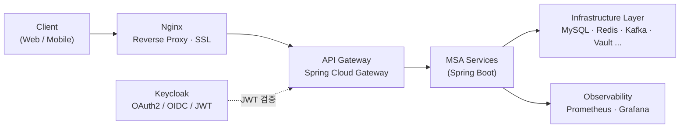

# MSA Starter Template

> 확장 가능한 MSA(Microservice Architecture) 개발 기본 템플릿
> **단계별 학습 목표 프로젝트** — Docker Compose → Kubernetes + ArgoCD → Spring AI

표준화된 환경에서 빠르게 시작하고, 공통 모듈을 재사용하며, 인프라를 자유롭게 교체·확장할 수 있는 MSA 스타터 템플릿입니다. 로컬 개발(Docker Compose)부터 운영 배포(Kubernetes), AI 기능 확장까지 단계적으로 성장하도록 설계했습니다.

---

## 🎯 목표

- **빠른 프로젝트 시작** — 표준화된 환경으로 보일러플레이트 최소화
- **MSA Best Practice** 기본 적용
- **확장 가능한 아키텍처** — 서비스/인프라 교체 및 추가 용이
- **CI/CD 및 모니터링** 기본 제공
- **단계적 성장** — 1단계(Compose) → 2단계(K8s) → 3단계(AI)

---

## 🏗️ 아키텍처 개요



요청 흐름: **Client → Nginx → API Gateway → MSA Services**
인증은 **Keycloak**이 담당하고, Gateway 단에서 JWT를 검증합니다.

---

## 🧩 핵심 구성 요소

### Gateway & 인증
| 구성 | 역할 |
|------|------|
| **Nginx** | Reverse Proxy, Static Files, SSL Termination |
| **API Gateway** (Spring Cloud Gateway) | Routing, Filter, Rate Limiting, Circuit Breaker, Logging |
| **Keycloak** | OAuth2 / OIDC, SSO, JWT, RBAC |

### 공통 모듈 (Common Modules)
| 모듈 | 역할 |
|------|------|
| `starter-core` | 공통 핵심 기능 |
| `starter-security` | 보안 / 인증 / 인가 |
| `starter-logging` | 로그 / MDC / 추적 |
| `starter-domain` | 공통 도메인 / 유틸 |

### 인프라 (Infrastructure Layer)
**Data Layer**
- **MySQL** — 관계형 데이터
- **Redis** — Cache / Session
- **Kafka** *(선택)* — 이벤트 스트리밍
- **OpenSearch** *(선택)* — 검색 / 분석

**Secret Management**
- **HashiCorp Vault** — DB Password, API Keys, JWT Secret, 외부 서비스 키 관리

**Cross-Cutting Infra** *(2차 이후)*
- **Config Server** — 설정 중앙화
- **Service Discovery** — Eureka / Consul
- **OpenTelemetry** — 분산 추적
- **Loki** — 로그 수집
- **Istio** *(선택)* — Service Mesh

### 관측 & 모니터링 (Observability)
- **Spring Actuator** — 애플리케이션 모니터링
- **Prometheus** — Metrics 수집
- **Grafana** — 시각화 / 대시보드
- **Alertmanager** — 알림

---

## 🔧 DevOps & CI/CD Pipeline

```
GitHub → Jenkins → SonarQube → Nexus → Docker Build → Push (Registry)
 소스      빌드/테스트   코드 품질    아티팩트     이미지 빌드     컨테이너 레지스트리
```

---

## 🚀 단계별 로드맵

### Phase 1 — Docker Compose 기반 개발환경 ✅
- 핵심 인프라 제공
- 빠른 로컬 개발 환경
- 일관된 개발 경험
- `docker compose up -d` 로 전체 환경 실행

### Phase 1.5 — 메시징 / 검색 기능 확장 *(선택)*
- **Kafka** — 이벤트 처리(비동기)
- **OpenSearch** — 검색 / 로그 분석

### Phase 2 — Kubernetes + ArgoCD 배포
- 컨테이너 오케스트레이션
- GitOps 기반 배포
- 확장성 / 고가용성

### Phase 3 — Spring AI 추가
- AI Gateway
- LLM 연동 (OpenAI, Claude 등)
- 문서 요약 / 생성
- 자동화 / 챗봇 등

---

## 📦 배포 환경

| 단계 | 환경 | 구성 |
|------|------|------|
| 1차 | **Docker Compose** (개발) | Nginx, Gateway, Keycloak, MSA Services, MySQL, Redis, Kafka, OpenSearch, Prometheus, Grafana |
| 2차 | **Kubernetes + ArgoCD** (운영) | K8s 오케스트레이션 + ArgoCD GitOps 배포 |

---

## ➕ 새 서비스 추가 방법

1. `starter-template` 기반 새 서비스 생성
2. 공통 모듈 의존성 추가
3. `application.yml` / Config 설정
4. Gateway 라우팅 등록
5. 배포 (Compose / K8s)

---

## 📚 학습 포인트

이 템플릿은 다음을 단계적으로 익히는 것을 목표로 합니다.

- MSA 기본 구조와 서비스 간 통신
- API Gateway / 인증·인가 (Keycloak, JWT)
- 공통 모듈 설계와 재사용
- 인프라 구성 (DB, 캐시, 메시징, 시크릿 관리)
- 관측성(Observability) 및 모니터링 체계
- CI/CD 파이프라인 구축
- 컨테이너 오케스트레이션과 GitOps (K8s, ArgoCD)
- AI 기능 통합 (Spring AI)

